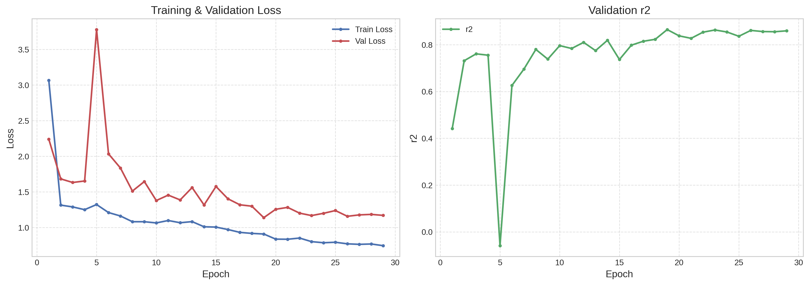
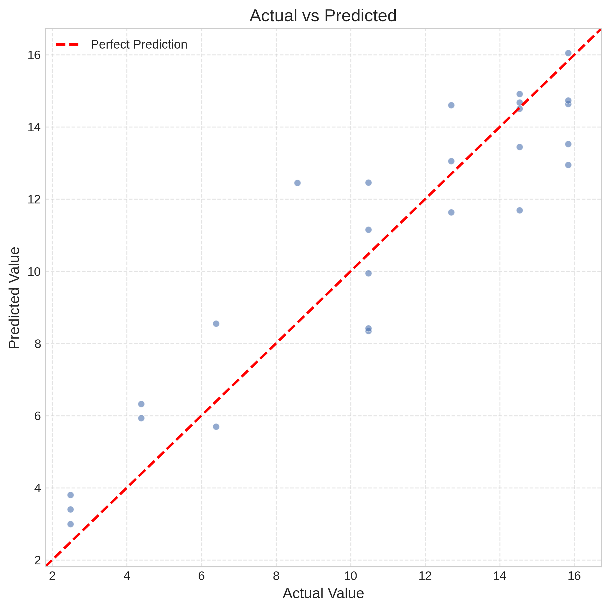
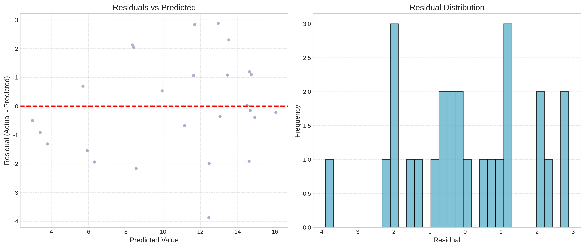

# Deep Learning Training Report: SPEED (RAD/S)

**Date**: 2026-01-15 18:30

## 1. Summary
- **Task**: regression
- **Source**: envelope_detrended
- **Seq Length**: 2048
- **Model**: base_ch=64, blocks=4, kernel=7, dropout=0.1
- **Epochs**: 80
- **LR Scheduler**: ReduceLROnPlateau(patience=2, factor=0.5)
- **Best Epoch**: 19
- **Best Metric**: 0.864735
- **Train Samples**: 102
- **Validation Samples**: 26
- **History CSV**: /home/milsonson/ai转速/train_models/train_history.csv

## 2. Training Curves

## 3. Validation Performance
- **R2**: 0.8647
- **MAE**: 1.3770
- **RMSE**: 1.6764

### Plots

